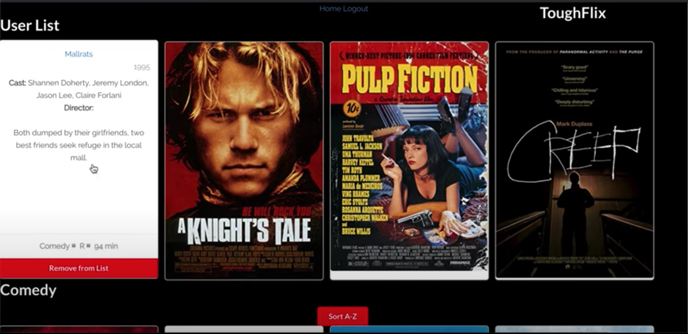

# ToughFlix Frontend

ToughFlix is a movie application that takes the stress of picking a movie out with another person and makes the choice a bit easier. This is done through connecting with a person and being able to reject or accept a movie from a list that is shared between the two.

The inspiration for this app was simple. In every relationship, whatever kind of relationship that is, being able to agree on something simple like picking a movie can be time consuming. ToughFlix takes that time and gives it back to you!

# Demo

👉 Watch it <a href="https://www.youtube.com/watch?v=hMUHb7im-XE">here!</a>




# Prerequisites

Before you begin, ensure that you have done the following:

- installed the latest version of NPM
```
    $ npm install
```

# Starting the App

Before running the server, make sure that you followed the steps on the Backend README under "Starting the App" so that the DB is loaded properly first.

Once you have started the Backend server, do the following:

- change directories 
```
    $ cd toughflix-frontend
```

- start the server
```
    $ npm start
```

# Features

✅ Account Authentication

✅ Persisting Data per Account

✅ Movie Sorting A-Z

# Built With


# Contributing to ToughFlix

To contribute to ToughFlix, follow these steps:

    1. Fork this repository.
    2. Create a branch: git checkout -b <branch_name>
    3. Make your changes and commit them: git commit -m "commit_message>"
    4. Push to the original branch: git push origin <project_name>/<location>
    5. Create the pull request.

# Contributers

Thank you to the following who have contributed to this project!

    @Tneebs 💻

# Contact 

If you would like to contact me, you can reach me at tedneben@gmail.com